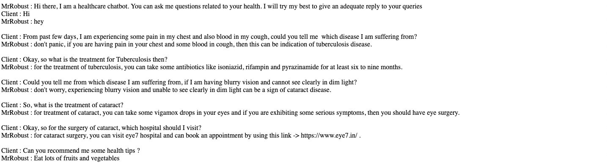
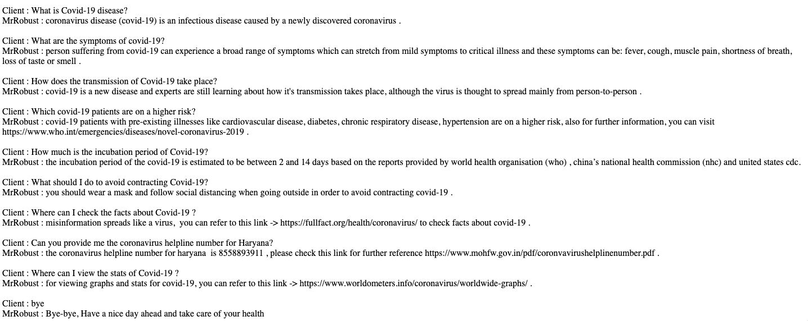

# MrRobust Chatbot

We have made an Artificial Intelligence chatbot. We have used NLP to train our chatbot to answer like humans. A really good chatbot understands what we’re asking for (even if we don’t use perfect grammar or spelling), and quickly satisfies your queries. 

## Key Features of the Chatbot

Chatbot are something that can be installed on a mobile device or a robot and can facilitate human activities without risking human lives, as we try to make the chatbot keeping the current pandemic in mind. Some of the key features are :

* Daily Health tip

* Client can tell his/her symptoms to the bot and the bot will provide him the disease name, treatment and hospital name

* Coronavirus helpline number

* Common questions asked related to Covid-19

## Sample replies by the Chatbot





## File Structure

```bash
├── AUTHORS.md
├── bot_replies.txt
├── data
│   ├── bot_data.txt
├── images
│   ├── Sample_Bot_Reply_1.png
│   └── Sample_Bot_Reply_2.png
├── LICENSE.md
├── requirements.txt
├── README.md
├── src
│   ├── bot_functions_file.py
│   ├── bot_main_file.py
│   ├── Eye_Disease_Detection_DSW.fnn.ipynb
│   ├── eye_disease_detection_file.py
│   ├── MrRobust_An_Healthcare_Chatbot_DSW.ipynb
```
## Eye Disease Detection Neural Network Model

Link for the dataset -> https://www.kaggle.com/jr2ngb/cataractdataset

Also we have made an Eye Disease Detection Neural Network Model that can detects a client’s eye disease through CNN’s, keras and Tensorflow.

We trained our model on Alibaba Cloud GPU service on over 450 samples over 50 epochs.

The Neural network is capable in detecting a normal eye from cataract or glaucoma or retina disease eye with an accuracy of 77.55% .

# Thank You
